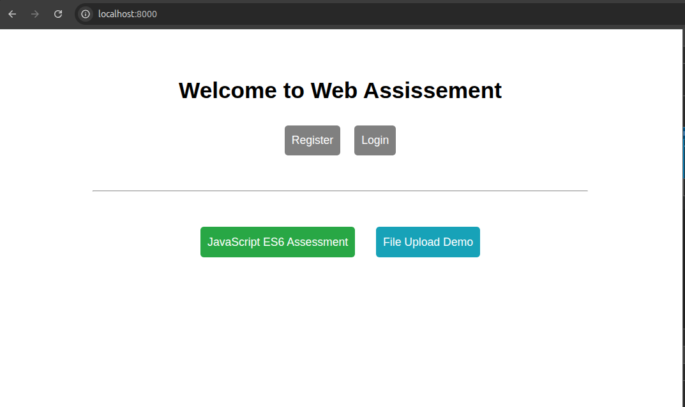
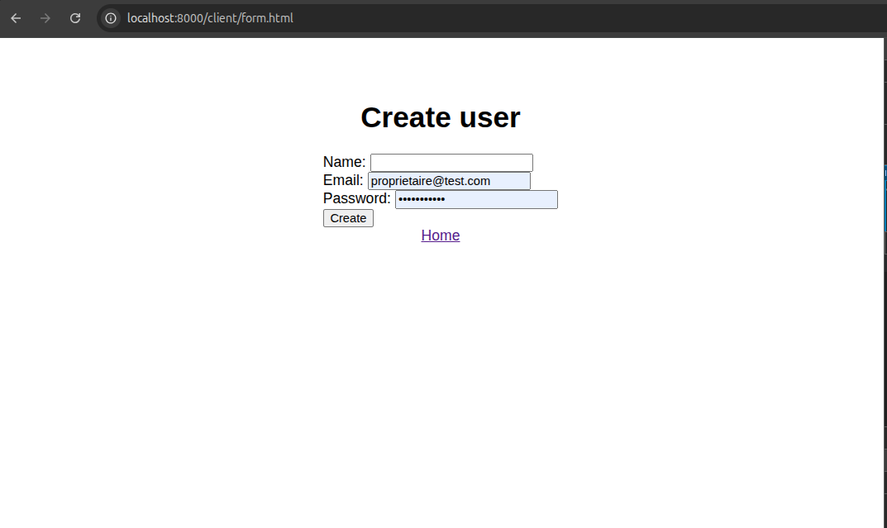
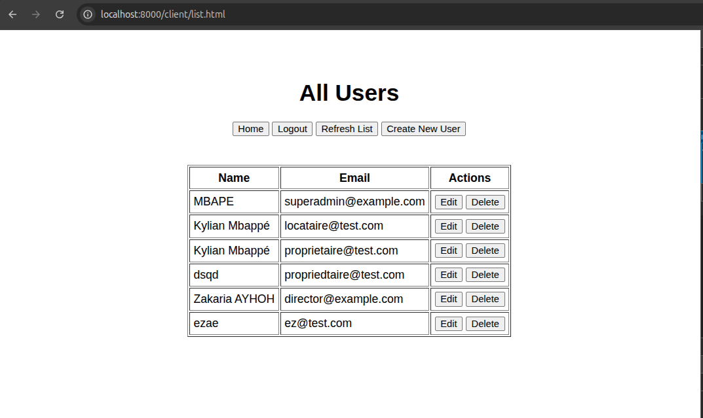
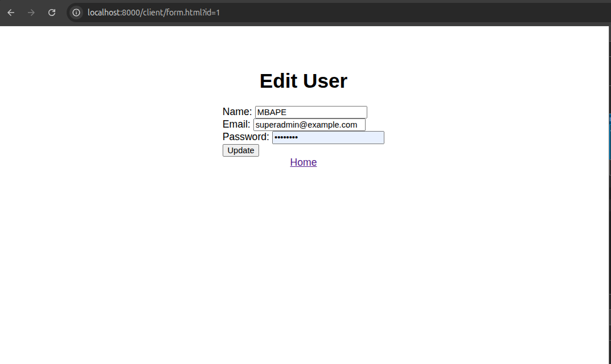
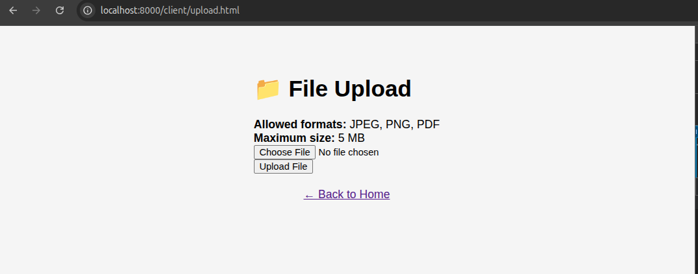
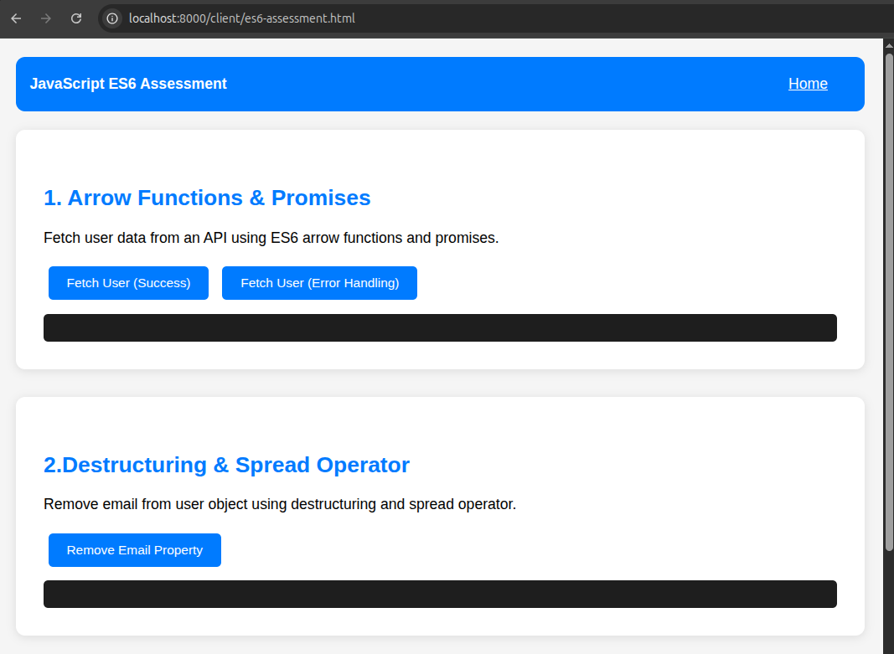
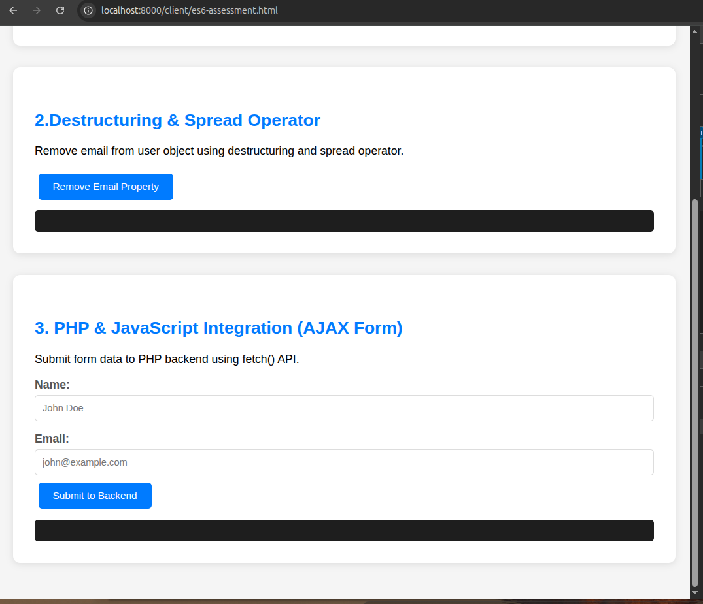

# Web Development Assessment

> A full-stack web application demonstrating web development practices with PHP backend, MySQL database, and vanilla JavaScript ES6 frontend.

[](https://opensource.org/licenses/MIT)
[](https://www.php.net/)
[](https://www.mysql.com/)
[](https://www.docker.com/)

## 📋 Table of Contents

- [Features](#features)
- [Screenshots](#screenshots)
- [Quick Start](#quick-start)
- [Technology Stack](#technology-stack)
- [Project Structure](#project-structure)
- [Security](#security)
- [License](#license)

## ✨ Features

### 🔐 User Management System
- User registration with automatic login
- Secure authentication with session management
- Full CRUD operations (Create, Read, Update, Delete)
- Password hashing with bcrypt
- CSRF protection on all forms

### 📁 File Upload System
- Secure file uploads (JPEG, PNG, PDF)
- MIME type validation
- File size limits (5 MB)
- Random filename generation
- Comprehensive error handling

### 💻 JavaScript ES6 Assessment
- Arrow functions & Promises
- Destructuring & Spread operators
- AJAX integration with Fetch API
- Interactive demo page

## 📸 Screenshots

### Home Page

*Landing page with authentication options*

### User Registration

*User registration form with validation*

### User List

*User management dashboard with CRUD operations*

### Login Page

*Secure login interface*
### Edit user Page

*Edit user interface*
### File Upload

*File upload interface with progress indicator*

### JavaScript ES6 Assessment


*Interactive ES6 demonstrations*

> **Note:** Screenshots are located in the `screenshots/` directory. To add your own screenshots, take screenshots of the application and save them in this folder.

## 🚀 Quick Start

### Prerequisites

- Docker Engine 20.10+
- Docker Compose 2.0+
- Git

### Installation

```bash
# 1. Clone the repository
git clone https://github.com/YOUR_USERNAME/csa-search-test.git
cd csa-search-test

# 2. Start the application
docker compose up -d --build

# 3. Initialize the database
docker exec -i assessment_db mysql -uappuser -papppassword assessment_db < sql/schema.sql

# 4. Access the application
# Main App: http://localhost:8000
# phpMyAdmin: http://localhost:8080
```
## Configuration

### Environment Variables (`.env`)
```env
DB_HOST=db
DB_NAME=assessment_db
DB_USER=appuser
DB_PASS=apppassword
```
### First Steps

1. Navigate to http://localhost:8000
2. Click "Register" to create an account
3. Login with your credentials
4. Explore the features:
   - User management (list, create, edit, delete)
   - File upload demo
   - JavaScript ES6 assessment

## 🛠️ Technology Stack

### Backend
- **PHP 8.4** - Server-side scripting
- **Apache** - Web server
- **MySQL 8.0** - Database
- **PDO** - Database abstraction layer

### Frontend
- **HTML5** - Markup
- **CSS3** - Styling
- **JavaScript ES6+** - Client-side logic
- **Fetch API** - AJAX requests

### DevOps
- **Docker** - Containerization
- **Docker Compose** - Multi-container orchestration
- **phpMyAdmin** - Database management

## 📁 Project Structure

```
csa-search-test/
├── docker/                     # Docker configuration
│   ├── Dockerfile             # PHP Apache container
│   └── uploads.ini            # PHP upload settings
├── public/                    # Web root
│   ├── index.php             # Landing page
│   ├── api/                  # API endpoints
│   │   ├── auth/            # Authentication
│   │   │   ├── login.php
│   │   │   ├── logout.php
│   │   │   └── register.php
│   │   └── users/           # User management
│   │       ├── create.php
│   │       ├── delete.php
│   │       ├── get_user.php
│   │       ├── list.php
│   │       ├── update.php
│   │       └── upload.php
│   ├── client/              # Frontend files
│   │   ├── assets/          # JavaScript files
│   │   ├── es6-assessment.html
│   │   ├── form.html
│   │   ├── list.html
│   │   ├── login.html
│   │   └── upload.html
│   └── server/              # Backend core
│       ├── classes/         # PHP classes
│       ├── config/          # Configuration
│       ├── controllers/     # Business logic
│       └── utils/           # Utilities
├── sql/                      # Database schema
│   └── schema.sql
├── uploads/                  # Uploaded files
├── screenshots/              # Application screenshots
├── docker-compose.yml        # Services configuration
├── .env                      # Environment variables
├── API.md                    # API documentation
├── DOCUMENTATION.md          # Technical documentation
└── README.md                 # This file
```

## 📚 API Documentation

Complete API documentation is available in [API.md](API.md).

### Quick Reference

**Authentication:**
- `POST /api/auth/login.php` - User login
- `POST /api/auth/register.php` - User registration
- `GET /api/auth/logout.php` - Logout

**User Management:**
- `GET /api/users/list.php` - List all users
- `GET /api/users/get_user.php?id={id}` - Get user by ID
- `POST /api/users/create.php` - Create user
- `POST /api/users/update.php/{id}` - Update user
- `POST /api/users/delete.php` - Delete user

**File Upload:**
- `POST /api/users/upload.php` - Upload file

**Utilities:**
- `GET /server/utils/get_csrf.php` - Get CSRF token

## 🔒 Security

This application implements multiple security layers:

- ✅ **CSRF Protection** - Token-based validation on all forms
- ✅ **Password Hashing** - Bcrypt with `password_hash()`
- ✅ **Session Management** - Secure cookie handling
- ✅ **SQL Injection Prevention** - Prepared statements
- ✅ **XSS Protection** - Security headers
- ✅ **Input Validation** - Client and server-side
- ✅ **File Upload Validation** - MIME type checking

## 🧪 Testing

### Manual Testing

```bash
# Start the application
docker compose up -d

# Run tests manually through the UI
# 1. Register a new user
# 2. Login
# 3. Create/Edit/Delete users
# 4. Upload files
# 5. Test ES6 demos
```

### Database Verification

```bash
# Access MySQL
docker exec -it assessment_db mysql -uappuser -papppassword assessment_db

# Check users
SELECT * FROM users;
```


## 📝 License

This project is licensed under the MIT License - see the [LICENSE](LICENSE) file for details.

## 👤 Author

**ZAKARIA BRAHAM**
- GitHub: [@bramz-00](https://github.com/bramz-00)
- Repository: [csa-research-web-assessment](https://github.com/bramz-00/csa-research-web-assessment)

**⭐ If you find this project useful, please consider giving it a star!**

## 📞 Support

For issues, questions, or suggestions:
- Open an issue on [GitHub](https://github.com/bramz-00/csa-search-test/issues)

---

Made with ❤️ using PHP, MySQL, and JavaScript ES6